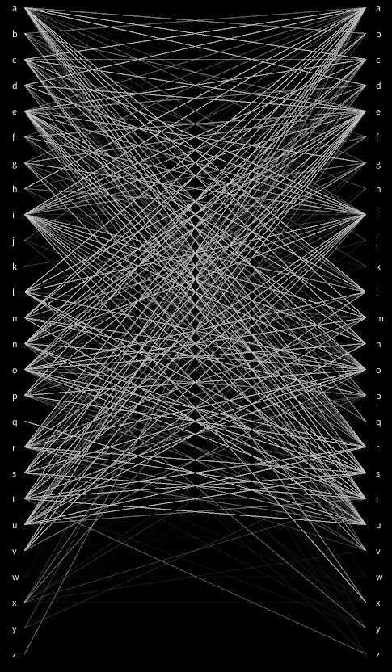
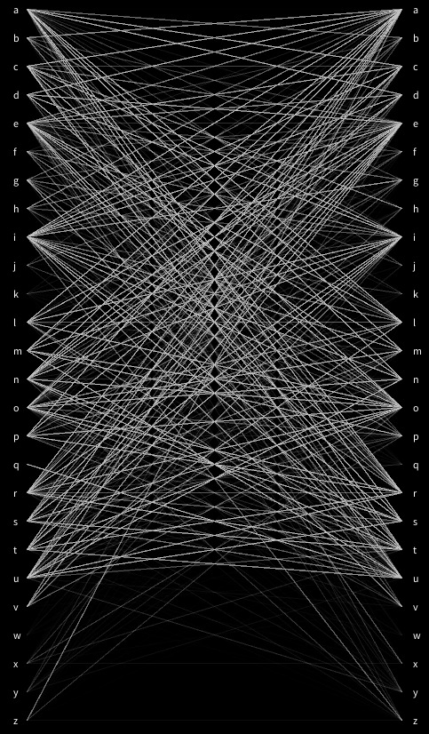
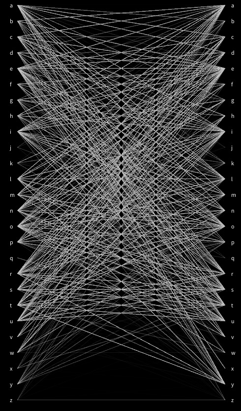
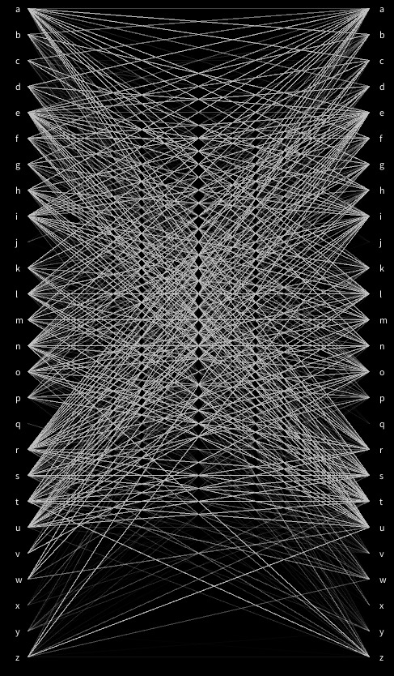

# Processing

Repository per fer exercicis i proves amb [Processing](https://processing.org/) per les assignatures [Tècniques de Programació I](https://www.esmuc.cat/wp-content/uploads/2021/12/Tecniques-de-programacio-I.pdf) i [II](https://www.esmuc.cat/wp-content/uploads/2021/12/Tecniques-de-programacio-II.pdf) del grau de [Sonologia](https://www.esmuc.cat/estudis/grau/sonologia/sonologia/) de l'ESMUC.

A les carpetes `/sketches tp1` i `/sketches tp2` hi ha programes per executar directament des de l'IDE de Processing. També hi ha les llibreries usades.

A la carpeta `p5.js` hi ha un exemple de processing insertat en un web amb la llibreria p5.js. Es pot veure el resultat [aquí](https://stratocastero.github.io/Processing/p5.js/).

## Lletres

L'_sketch_ [lletres](https://github.com/StratocasterO/Processing/blob/main/sketches/lletres/lletres.pde) dibuixa una línia entre cada parell de lletres consecutives del text donat. Pot ser interessant per comparar llengües.

| Català | Castellà | Anglès | Alemany |
|--------|----------|--------|---------|
|   |   |  |  |

Això és un exemple de les imatges generades usant com a text un [article de la Viquipedia](https://ca.wikipedia.org/wiki/M%C3%BAsica) en quatre llengues diferents. Els accents i altres lletres alterades han estat eliminats usant [aquest web](https://codebeautify.org/remove-accents).

### Idees de projectes

- Random walker
- Random walker amb `noise()`
- Falling blocks
- [Falling sand](https://www.youtube.com/watch?v=L4u7Zy_b868&ab_channel=TheCodingTrain) (with physics)
- Dibuixar graella de `n` per `m` blocs que es puguin pintar (per fer [això](https://www.youtube.com/watch?v=TdTMeNXCnTs))
- Pilotes generades al fer clic
- Simulació [pluja](https://www.youtube.com/watch?v=KkyIDI6rQJI)
- Salvapantalles estrelles (rollo Star Wars)
- Simulació [model d'Ising](https://physics.weber.edu/schroeder/software/demos/isingmodel.html) ([simulació](https://physics.weber.edu/schroeder/software/demos/isingmodel.html))